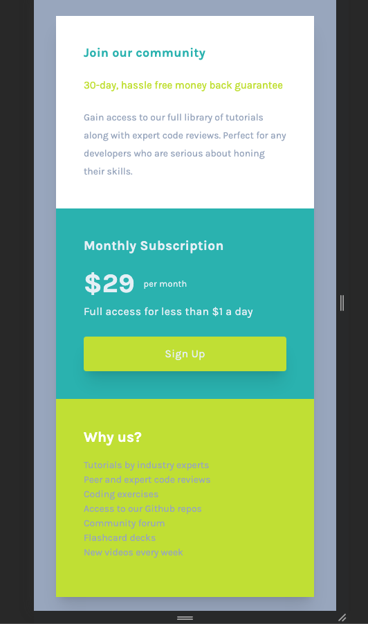
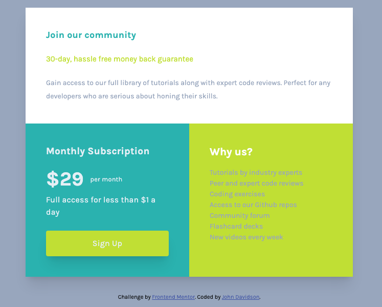

# Frontend Mentor - Single price grid component solution

This is a solution to the [Single price grid component challenge on Frontend Mentor](https://www.frontendmentor.io/challenges/single-price-grid-component-5ce41129d0ff452fec5abbbc). Frontend Mentor challenges help you improve your coding skills by building realistic projects.

## Table of contents

- [Overview](#overview)
  - [The challenge](#the-challenge)
  - [Screenshot](#screenshot)
  - [Links](#links)
- [My process](#my-process)
  - [Built with](#built-with)
  - [What I learned](#what-i-learned)
  - [Continued development](#continued-development)
  - [Useful resources](#useful-resources)
- [Author](#author)
- [Acknowledgments](#acknowledgments)

## Overview

### The challenge

Users should be able to:

- View the optimal layout for the component depending on their device's screen size
- See a hover state on desktop for the Sign Up call-to-action

### Screenshot





### Links

- Solution URL: [Add solution URL here](https://github.com/John-Davidson-8/fem-single-price-grid-component)
- Live Site URL: [Add live site URL here](https://fem-single-price-grid-component-main.netlify.app/)

## My process

I began mobile first using grid one column. For larger screens I added a media query at 38rem width which added a second column. The card has three sections on on top of the other in mobile view. In wider view the top section spreads out over one column, and the lower two sections are set side by side.

### Built with

- Semantic HTML5 markup
- CSS custom properties
- CSS Grid
- Mobile-first workflow

### What I learned

I learned loads in this project as it is my first using CSS Grid. I found after watching tutorials and reading docs on Grid, that putting the theory into practice was challenging. I feel that I over-code and have to strip back before completion. I am still challenged by padding and margins, when to use which? I have also used variables in the css for colors, fonts, and box-shadows. This speeds things up.

One particular aspect of html I learned in this project was how to use the span class to place text side by side in a variety of ways. In the CSS I learned the vertical-align property. The image below details this. I would usually use Flex-box for this, but it is good to have other tools in the box.


This is the html and css code below:

```html
<div class="card-pricing">
  <h2>Monthly Subscription</h2>
  <span class="price">$29</span><span class="per">per month</span>
  <p class="card-price-dollar">Full access for less than &dollar;1 a day</p>
  <a class="card-price-cta" href="#">Sign up</a>
</div>
```

```css
.price {
  display: inline-block;
  margin-top: 0.7rem;
  vertical-align: middle;
  font-size: 2.4rem;
  font-weight: bolder;
}
.per {
  display: inline-block;
  margin-top: 0.7rem;
  vertical-align: middle;
  padding-left: 0.8rem;
}
```

Below is the css for the media query to change the grid layout to make it responsive.

```css
@media screen and (min-width: 38.75rem) {
  .card {
    grid-template-columns: 1fr 1fr;
  }
  .card-info {
    grid-column-start: 1;
    grid-column-end: 3;
  }
}
```

### Continued development

Moving forward I realize my weakness is over-coding and hopefully CSS Grid will help with this, where i can strip back the unnecessary code. I am becoming more competent with writing the README files and markdown in general. Also, I know moving forward that I must start to use the dev tools more for de-bugging. With JS on the horizon also this would be highly beneficial.

### Useful resources

- [Example resource 1](https://www.udemy.com/course/in-depth-html-css-course-build-responsive-websites/) - This helped me to learn a great deal of html and css. I re-watched the section on CSS Grid.
- [Example resource 2](https://shrutibalasa.gumroad.com/l/css-flex-and-grid) - This is an amazing book which helped me finally understand aspects of Flex-box and Grid. I'd recommend it to anyone still learning this concept.

## Author

- Website - [John Davidson ](https://www.upwork.com/en-gb/freelancers/~018613765e268de80b?viewMode=1)
- Frontend Mentor - [@John-Davidson-8](https://www.frontendmentor.io/profile/John-Davidson-8)
- Twitter - [@yourusername](https://www.twitter.com/yourusername)

## Acknowledgments

Big shout out to @Grace-snow (https://fedmentor.dev/) and Chamu at Frontend Mentor for their help as always. Thanks guys.
